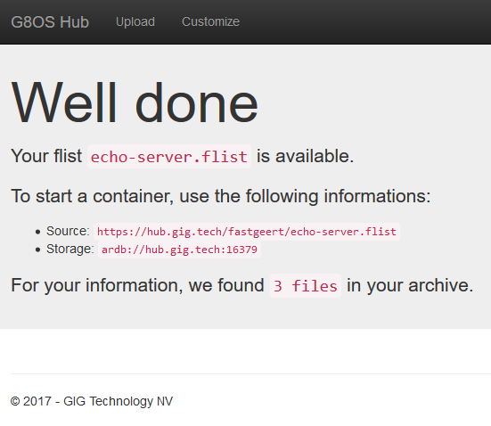
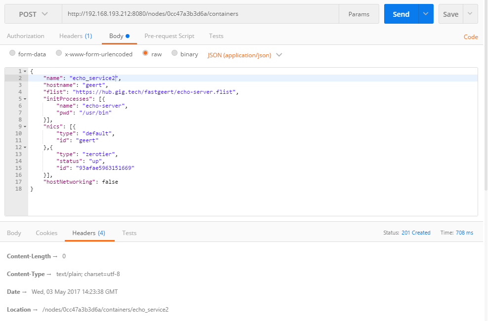

# Create a Flist and Start a Container

Zero-OS containers are booted using a flist. A flist is basically a recipe of files and folders with pointers to the actual content of the filesystem with which the container is started. These files will get downloaded from the storage backend (typically the [Zero-OS Hub](https://hub.gig.tech)) when needed.

In this tutorial we will create a flist ourselves, upload it to the Zero-OS Hub, and then use it to start a Zero-OS container to which we'll connect to over its ZeroTier management network.

We'll use a simple [Echo Server](https://github.com/luisbebop/echo-server) written in Go to illustrate creating a flist.

So there are basically two steps:
- [Create the flist](#create-the-flist)
- [Start the container](#start-the-container)


## Create the flist

Creating a flist is done in two steps:
- First we need to assemble the files and folders we need in the resulting filesystem into a tar.gz archive locally
- Then we need to publish that archive to the hub (https://hub.gig.tech)

The second step will actually result in the creation the flist.

### Creating the tar archive

Creating the tar archive can be achieved by manually assembling the needed files and folders or via preparing the application locally into a Docker container, and sequentially exporting that Docker container into a tar archive via the [``` docker export```](https://docs.docker.com/engine/reference/commandline/export/) command. In what follows we show how to do it manually.

In order to assemble the required files, we first need to compile the Go code, which can achieved easily using Jumpscale. We recommend using a JS9 Docker container for this, for the installation instructions see: https://github.com/Jumpscale/developer.

From within your JS9 Docker container start the interactive Jumpscale shell:
```bash
js9
```

Install Go:
```python
j.tools.prefab.local.development.golang.install()
```

Then build the Echo Server, again using the Jumpscale:
```python
j.tools.prefab.local.development.golang.get('github.com/luisbebop/echo-server')
```

As a result the Echo Server will be build, the result will be available in `/opt/jumpscale9/go/proj`:
```bash
ls /opt/jumpscale9/go/proj/src/github.com/luisbebop/echo-server/
Dockerfile  README.md  echo-server  main.go  main_test.go
```

Now create the tar:
```bash
mkdir -p /optvar/data/images/echo-server/usr/bin
cp echo-server /optvar/data/images/echo-server/usr/bin
cd /optvar/data/images/echo-server
tar -cvzf /optvar/data/images/echo-server.tar.gz usr
```

### Publishing the flist onto hub.gig.tech

Okay we have our tar archive ```/optvar/data/images/echo-server.tar.gz``` in your JS9 Docker container, or ```~/gig/data/images/echo-server.tar.gz``` in your host machine, now let's get it published so we can use it to start a container.

Navigate your browser to https://hub.gig.tech. Press the **Upload my file** button. The first time you press it, you will be redirected to [ItsYou.online](https://itsyou.online) to authenticate yourself. Then you'll need to press it again to select your `tar.gz` archive for upload.

When you uploaded your `tar.gz` file you'll see something like to following:


As a result the flist will be generated based on the tar you uploaded.

## Start the container

Two options:
- Deploy the container by interacting directly with a Zero-OS node
- [Deploy the container by using the Zero-Orchestrator](#deploy-the-container-by-using-the-zero-orchestrator)

Below we discuss the second option.

### Deploy the container by using the Zero-Orchestrator

@todo needs review

Next will use the Zero-OS Orchestrator RESTfull API to bring up a container using our brand new flist.

In order to use this RESTful API you need to add a Zero-OS Orchestrator to your Jumpscale Docker container and have all your Zero-OS nodes booted, as documented in [Setup](https://github.com/zero-os/0-orchestrator/blob/master/docs/setup/setup.md).

Let's take a look at the Orchestrator Restful API to learn how we can start a container on a Zero-OS node:
https://rawgit.com/zero-os/0-orchestrator/1.1.0-alpha/raml/api.html#nodes__nodeid__containers_post

Before we can start the container, we need to decide on which node in your Zero-OS we are gonna deploy it. So let's list up the nodes in our resource pool:
```shell
curl -sL http://192.168.193.212:8080/nodes | underscore print --color
```

Next step is to create the container using the following post request:


More information on the complete API can be found on [zero-os/0-orchestrator/master/raml/api.html](https://htmlpreviewer.github.io/?https://raw.githubusercontent.com/zero-os/0-orchestrator/master/raml/api.html)

> Note:
> It is best to use a separate ZeroTier network for this exercise. Makes it simpler to identify the container that is joining the network.

Okay the container is created, now you need to allow it into your ZeroTier network. Please notice the IP address your container receives in the ZeroTier network. In my case it was **192.168.193.96**. So let's test if the echo-server in the container is working using the ZeroTier IP address:

```shell
telnet 192.168.193.96 8800
Trying 192.168.193.96...
Connected to 192.168.193.96.
Escape character is '^]'.
hahaha]
CLOUDWALK hahaha]
Connection closed by foreign host.
```

It does. So that means were done!
